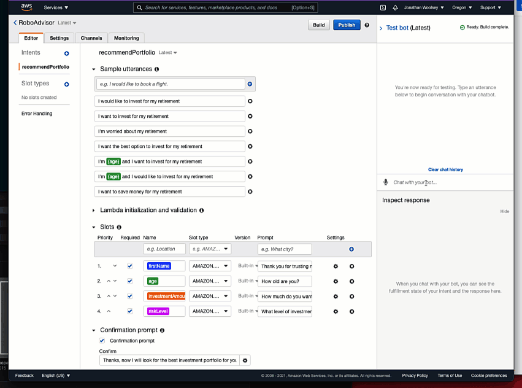
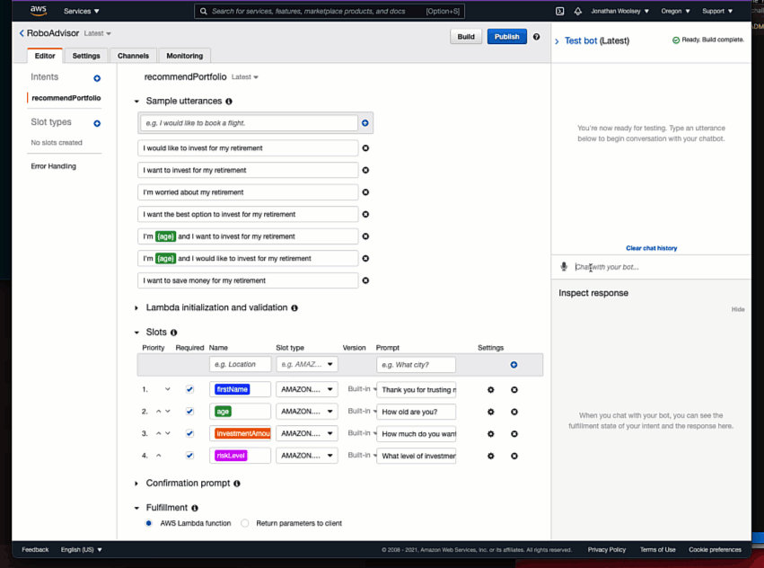

# Retirement Investment Portfolio Chatbot (module_15_challenge)

A lambda function and test events used in the context of an Amazon Lex chat application. This application is a simple Robo Advisor that takes several inputs from a user and outputs a portfolio recommendation based on their investment amount and risk tolerance.

---

## Technologies

- python 3.7
- Amazon Lex (v1)
- AWS Lambda

---

## Demos

### Initial Robo Advisor (without Lambda)

### Final Robo Advisor (with Lambda)

---

## Contributors

---

## License

GNU GPLv3
